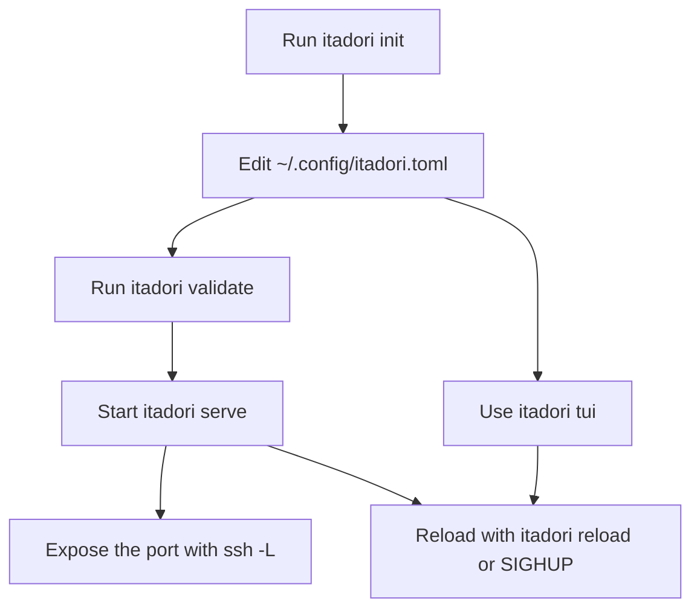

# Itadori

Local Rust gateway for private APIs, designed to sit behind `ssh -L`.

## Binary

Build the release binary with:

```bash
cargo build --release
```

The executable is written to `target/release/itadori`.

## Default Config

By default, Itadori reads:

```text
~/.config/itadori.toml
```

## Quick Start

```bash
itadori init
itadori validate
itadori serve
itadori reload
itadori tui
itadori self-update
```

## Recommended Flow



## SSH Forwarding

Example:

```bash
ssh -L 8787:127.0.0.1:8787 user@notebook
```

Then access `http://127.0.0.1:8787` from another machine.

## Configuration

Minimal example:

```toml
[server]
bind = "127.0.0.1:8787"
max_body_bytes = 10485760
request_timeout_ms = 30000

[[routes]]
name = "jira"
prefix = "/jira"
upstream = "https://jira.internal.example.com"
strip_prefix = true
```

### Fields

`server.bind`
: local listening address.

`server.max_body_bytes`
: maximum request body size.

`server.request_timeout_ms`
: default timeout per route.

`routes[]`
: list of routes, each with `name`, `prefix`, `upstream`, `strip_prefix`, and optional `headers`.

## Reload Without Restart

Reload is handled through `SIGHUP`.

```bash
itadori reload
```

If `server.bind` changes, the process must be restarted.

## Self Update

Update the current binary from the latest GitHub release:

```bash
itadori self-update
```

Official release builds embed the GitHub repository automatically. For local
or custom builds, pass the repository explicitly:

```bash
itadori self-update --repo owner/repo
```

Private releases can use `GITHUB_TOKEN` or `--token`.

## TUI

The TUI uses Ratatui for a softer, anime-inspired dashboard.

```bash
itadori tui
```

Keys:

```text
r  reload config
q  quit
```

## Full Example

See `gateway.example.toml`.

## License

MIT
